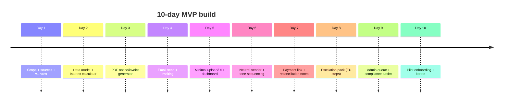

# Statutory Interest Autopilot for Late Invoices in the EU

## Candidate shortlisting and final pick

Across Europe, late B2B payments are a recurring, financially urgent problem for non-tech SMEs (trades, agencies, wholesalers, clinics, small manufacturers). Two strong indicators stand out:

- A large share of enterprises report being harmed by late payment. In the EU Payment Observatory’s Annual Report (SAFE survey aggregation), *almost half* of surveyed companies (47%) reported issues due to not being paid on time in 2023, up from 2022. citeturn15view0turn19view0  
- Even when EU law grants creditors clear rights (interest + recovery-cost compensation), most don’t exercise them. A summary from the entity["organization","European Parliamentary Research Service","eu policy research unit"] states that the impact assessment notes *70% of businesses do not claim* interest or compensation, including the €40 flat-fee compensation. citeturn8view0  
- The entity["organization","European Commission","eu executive body"] explicitly highlights the behavioral blocker: SMEs are reluctant to exercise these rights for fear of damaging commercial relationships. citeturn11view0  

This combination (high incidence + unclaimed money + fear/awkwardness) is a classic “why didn’t I think of that” wedge: the value already exists **in law**, but behavior and workflow prevent capture.

### Comparison of top candidate ideas

| Candidate idea | Core wedge / “why didn’t I think” | Pain severity | Willingness-to-pay | MVP in ~10 days | Competition level |
|---|---|---|---|---|---|
| EU statutory interest + recovery-fee autopilot for late invoices (recommended) | “You’re legally owed extra money; we claim it without you being the bad guy.” | High (cashflow) | €15–€100+/mo; €50–€500+ done-for-you | Yes | Medium (tools exist; gap is hybrid + EU-specific enforcement) |
| Construction retention-money tracker + claim autopilot | “Profit is trapped in retention; we release it on dates you forget.” | High (cashflow/profit) | €50–€200+/mo | Yes | Medium (niche tools exist; fragmented) |
| Tenant deposit return evidence kit + dispute navigator | “Turn your photos into dispute-grade evidence + timeline.” | Medium–High (one-time) | €50–€200 one-time | Yes | Medium (apps emerging) |
| EU warranty/repair claim concierge for high-ticket items | “Make the seller comply with 2-year guarantee with minimal friction.” | Medium (time + money) | €50–€300 one-time | Yes | Medium–High (advice sites + some services) |
| Expat “first 30/90 days bureaucracy concierge” | “Outsource the life-admin you can’t Google fast enough.” | High (emotion) | €200–€2,000+ packages | Yes (service-heavy) | High (many country-specific providers) |

**Recommended single problem/idea:** **EU statutory interest + recovery-cost (“€40”) claim automation for late-paid B2B invoices**, delivered as a **service+tech hybrid** that removes awkwardness and turns “legal entitlement” into “standard process”.

## The problem in one sentence

**Millions of EU small businesses are paid late, but most do not claim the statutory interest and fixed recovery-cost compensation they’re entitled to—because it’s awkward, unclear, and operationally annoying—so they silently lose money and time.** citeturn15view0turn8view0turn11view0  

### Why this meets your constraints

**Painful, frequent, urgent:**  
Late payments directly hit liquidity; the EU already treats this as an SME competitiveness issue and is actively revising the regime. citeturn11view0turn11view1

**Willingness-to-pay is structurally supported:**  
Under the EU framework, creditors can claim **statutory interest** and **minimum €40 compensation** for recovery costs on late B2B / B2G payments (subject to national implementation details). citeturn11view0turn2view2  
When customers are late, the “budget” for your tool/service can come from the incremental recovery (interest/compensation) or from reduced time/DSO.

**MVP in ~10 days for a backend solo founder:**  
The MVP can be mostly backend automation (rule engine + templates + email sending + PDF generation) plus a light UI, starting with **manual review** and a narrow scope.

**Not an obvious AI-wrapper:**  
The wedge is regulatory + workflow + behavioral (blame-shifting, tone staging, “policy not personal”), not “chat with your invoices”.

**Saturation check:**  
There are tools that send reminders or add generic late fees, but the market is fragmented, often accounting-platform-dependent, and not centered on **EU statutory entitlements + relationship-safe enforcement**. citeturn14view3turn14view4turn14view2turn2view2  

## Market scan: competitors, substitutes, and the gaps

### What exists today

**Accounting-suite features (generic late fees)**  
- entity["company","Intuit","accounting software vendor"]’s QuickBooks Online supports automatic late fees (configurable amount/timing) and applies them as line items, with jurisdictional caveats. citeturn14view3  
This is useful, but it’s not “EU statutory interest + €40 per invoice” by default, and it assumes you’re already inside that product.

**AR automation layers (accounting integration first)**  
- entity["company","Paidnice","accounts receivable automation"] integrates with accounting systems (e.g., Xero) and can automatically detect overdue invoices and issue late fees/interest charges. citeturn14view4turn14view1  
It also indicates Bank of England rate automation (UK-centric signal) and requires Xero/QuickBooks workflows. citeturn14view1  

**Freelancer-oriented invoicing + reminders (relationship/awkwardness addressed)**  
- entity["company","Invoxo","EU invoicing software"] positions automated payment reminders as a way to avoid uncomfortable follow-up and provides EU late-payment directive educational content. citeturn14view2turn12search1  

**Official guidance and calculators (but not execution)**  
- The Commission’s “Your Europe” business portal provides statutory interest rates by EU country and guidance (including the €40 compensation and VAT treatment). citeturn2view2  
- The Commission’s late-payment page summarizes the directive’s main provisions and explicitly notes reluctance to claim rights due to relationship concerns. citeturn11view0  

### The gaps that make this still a “wedge”

**Gap: EU statutory entitlement is not operationalized where most SMEs live**  
A lot of microbusinesses invoice via PDFs, email, WhatsApp, spreadsheets, or local invoicing tools—not necessarily via Xero/QuickBooks integrations. Competing solutions skew toward accounting-platform users (or broad AR teams), leaving a large “low tooling” segment underserved (in practice, this segment is huge given how many EU enterprises are micro). citeturn9view1turn9view2  

**Gap: Behavior is the bottleneck, not just calculation**  
Even with legal entitlement, 70% don’t claim. The “product” must be a **behavioral prosthetic**: staged tone, neutral sender identity, and escalation that feels like process, not conflict. citeturn8view0turn11view0  

**Gap: Cross-border escalation path is poorly packaged**  
When the debtor is in another EU country, “what next?” is unclear. Yet EU mechanisms exist (payment order; small claims up to €5,000) but are not packaged as an SME-friendly, stepwise playbook. citeturn20search0turn20search1turn20search21  

### Prioritized evidence links

```text
EU late payment rules + directive provisions (European Commission):
https://single-market-economy.ec.europa.eu/smes/challenges-and-resilience/late-payment_en

Statutory interest rates by EU country + €40 compensation + VAT treatment (Your Europe):
https://europa.eu/youreurope/business/finance-funding/making-receiving-payments/late-payment/index_en.htm

EU Payment Observatory Annual Report 2024 (late payment prevalence; 47% figure):
https://cdn.ceps.eu/wp-content/uploads/2024/12/EU-Payment-Observatory_Annual-Report-2024_EA-01-24-061-EN-C.pdf

EPRS briefing (70% don’t claim interest/€40 compensation):
https://www.europarl.europa.eu/RegData/etudes/BRIE/2024/757800/EPRS_BRI%282024%29757800_EN.pdf

EU enterprise counts (Eurostat structural business stats):
https://ec.europa.eu/eurostat/statistics-explained/index.php?title=Structural_business_statistics_overview

QuickBooks automatic late fees doc (baseline substitute):
https://quickbooks.intuit.com/learn-support/en-us/help-article/invoicing/understand-automatic-late-fees-quickbooks-online/L0gewLCxt_US_en_US

Paidnice (AR automation substitute):
https://apps.xero.com/us/app/paidnice

Invoxo payment reminders (substitute for “awkward chasing”):
https://invoxo.eu/payment-reminders

EU small claims procedure (up to €5,000) (escalation step):
https://e-justice.europa.eu/topics/money-monetary-claims/small-claims_en
```

## Market sizing and monetization for Europe

### TAM and SAM (EU-focused; transparent assumptions)

**Enterprise base (EU):**  
entity["organization","Eurostat","eu statistics agency"] reports **33.1 million enterprises active in the EU in 2023**, with **99.8% SMEs**. citeturn9view2  

**How many feel the pain:**  
The EU Payment Observatory annual report highlights that **47% of surveyed firms** reported issues due to not being paid on time in 2023 (SAFE survey), and this increased vs. 2022. citeturn15view0turn19view0  

**TAM (problem-exposed)** *(estimate)*:  
33.1M enterprises × 47% ≈ **15.6M enterprises** experiencing late-payment issues in a given year (EU-wide). This is a *problem TAM*, not an addressable customer count, but it sets the ceiling. citeturn9view2turn15view0  

**SAM (initial addressable)** *(estimate; assumptions stated)*:  
Start with micro/small B2B service firms issuing recurring invoices (agencies, professional services, trades). Services account for about **63% of enterprises** in the EU business economy. citeturn9view2  
If you assume you can realistically target ~5–10% of the problem-exposed group in your first “scope” (English-first + EU debtor countries + invoice amounts where the extra recovery is meaningful), that yields **~0.8M–1.6M potential accounts** over time. This is intentionally conservative and should be replaced with bottom-up numbers during validation.

### Revenue model options

A key rule: **charge for de-risking awkwardness + saving time**, not for “sending reminders”.

**Subscription (most scalable):**
- €19–€49/mo for “Self-serve autopilot” (X invoices/month)
- €99–€199/mo for “Pro + multi-entity + templates + escalation packs”

**Hybrid (best for early monetization):**
- €29–€79/mo platform + **€15–€49 per invoice case** (“claim pack” generation + delivery + tracking)
- Optional **“done-for-you collections desk”** add-on: €199–€499/mo (human-in-loop calls/letters and handoff to a partner)

**Success-fee (behaviorally aligned, but needs guardrails):**
- % of *incremental* recovered statutory interest/fees (not the principal), which reduces trust issues. (Legal/ethical positioning must be careful; see risks.)

### Quick defensibility angles

**Regulatory rules engine + continuous updates**  
Official statutory interest rates vary by country and period. The official portal lists country rates and rules; building a trustworthy update pipeline becomes a moat. citeturn2view2turn11view0  

**Behavioral productization**  
The Commission explicitly states relationship fear suppresses usage; build “blame-shifting” and tone staging as a core feature, not a nice-to-have. citeturn11view0turn8view0  

**Escalation pathway packaging (cross-border)**  
Bundling a practical step-up to EU processes (Payment Order; Small Claims up to €5,000; enforcement order) makes you “end-to-end” without being a law firm. citeturn20search0turn20search1turn20search2  

## Recommended single idea: “EU Late Payment Rights Autopilot” (service + tech)

### Executive summary

Build a lightweight platform that helps EU freelancers and small businesses **claim statutory late-payment interest and recovery-cost compensation** on overdue B2B invoices—without interpersonal conflict.

The product’s “aha” is **a neutral, policy-driven collections desk**:  
- It calculates what’s owed using official rates (by country, by period). citeturn2view2  
- It generates a compliant “interest + compensation” add-on invoice/notice and sends it in staged tones. citeturn2view2turn11view0  
- It logs outcomes and prepares an escalation pack for cross-border paths if needed. citeturn20search1turn20search21  

This is explicitly designed to overcome the known adoption blocker: SMEs fear damaging relationships and therefore don’t use their rights. citeturn11view0turn8view0  

### Ten-day MVP plan (day-by-day)

**MVP scope choice (important):** Start as **“invoice-case autopilot”** (upload invoice → compute entitlement → generate pack → send sequence), not as full invoicing software.

| Day | Deliverable | Backend-heavy tasks |
|---|---|---|
| Day 1 | Scope + legal-of-record sources | Define supported countries v1; codify rules from official portal; decide “not legal advice” framing. citeturn2view2turn11view0 |
| Day 2 | Data model + rules engine skeleton | InvoiceCase entity; rate table keyed by (country, period); compute interest on gross incl. VAT; no VAT on interest (per guidance). citeturn2view2 |
| Day 3 | PDF generation | Produce “Add-on invoice / Notice of statutory interest & recovery fee” PDF with audit fields (timestamps, calculation). |
| Day 4 | Email sending + tracking | SMTP/ESP integration; message templates (gentle/firm/final); open/click tracking; logging. |
| Day 5 | Minimal UI | Upload invoice / enter key fields; debtor email; preview pack; “send” button; simple dashboard. |
| Day 6 | “Neutral sender” + branding mode | Send from “Accounts Desk” identity (your domain) or white-label (customer domain later). Emphasize “policy”. |
| Day 7 | Payment capture | Add “pay now” link (bank details + optional card). Keep it simple; avoid heavy fintech. |
| Day 8 | Escalation pack v1 | Generate a structured pack: timeline, sent notices, invoice details, and links to EU small claims/payment order info. citeturn20search0turn20search1 |
| Day 9 | Admin + ops hardening | Manual review queue; toggles; rate updates; GDPR basics (data deletion, export). |
| Day 10 | Pilot launch | Onboard first 3–5 customers manually; run end-to-end on live overdue invoices; measure outcomes. |

#### Simple visual: MVP timeline



### 48-hour validation experiments (high-signal, low-build)

**Experiment design principle:** Sell the *outcome* (“get paid faster + claim what you’re owed”) and the *awkwardness removal*, not the calculator.

**Experiment A: “We calculate your claim in 15 minutes” outbound**
- Target: freelancers/agencies/trades with B2B invoices (LinkedIn, local FB groups, chambers).  
- Offer: “Send one overdue invoice; we reply with the exact statutory interest + €40 claim pack. If you don’t want to send it, we’ll just estimate from amount & due date.”  
- Success metric (48h): 20 conversations → 5 invoice samples → 2 paid pilots.

Why it’s strong: the EPRS and Commission both signal low adoption due to reluctance; your pitch directly removes that barrier. citeturn8view0turn11view0  

**Experiment B: Landing page + “free official-rate calculator” lead magnet**
- Build a one-page calculator using the official interest-rate table concept; gate the “send it for me” feature behind email. The official portal already has a calculator, but most people still don’t act; your lead magnet bridges to execution. citeturn2view2turn11view0  
- Success metric (48h): 200 visits (small paid + posts) → 20 emails → 5 “send it for me” requests.

**Experiment C: Accountant/bookkeeper partner interviews**
- Message 20 bookkeepers/accountants: “Do your clients avoid claiming statutory interest? Would you refer a tool that does it without harming relationships?”  
- Success metric (48h): 3 calls + 1 referral agreement.

### First-10-customer playbook (scripts/templates)

#### ICP (first wedge)
- “Service micro-SMEs” (design studios, marketing agencies, consultancies, trades) issuing monthly invoices.
- Cross-border contractors inside the EU (extra uncertainty → higher urgency).

#### Outreach DM (short)
Subject: **You’re likely owed extra money on that late invoice (EU law)**

Message:
> Hi {{Name}} — quick one: under EU late-payment rules, overdue B2B invoices can accrue statutory interest + a fixed recovery-cost fee (€40 minimum). Most businesses never claim it because it feels awkward. If you send me one overdue invoice amount + due date + debtor country, I’ll calculate what you’re entitled to and generate a ready-to-send “payments desk” notice.

Grounding: statutory entitlements + €40 concept are summarized by the Commission and Your Europe. citeturn11view0turn2view2  

#### Offer framing for the first 10
- “**One invoice case** handled end-to-end for €79” (one-time)  
- Or “**€49/mo** for up to 5 cases/month” (founding plan)  
Position it as: “You’ll likely recover the fee from the first successful claim.”

#### Pilot onboarding checklist (what you ask for)
- Invoice PDF (or amount/date terms)
- Debtor country (for statutory rate selection) citeturn2view2  
- Debtor email + CC rules
- Your bank details + payment instructions
- Preferred tone mode: “soft”, “standard”, “firm” (psychological control increases adoption)

### Pricing strategy (designed to reach €100k ARR)

**Target: €100k ARR = ~€8.3k MRR.**

A realistic path is to use a **two-tier ARPA** model:

- **Self-serve:** €29/mo (solo) or €59/mo (small team)  
- **Done-for-you add-on:** +€199/mo (includes human follow-up for up to N cases, plus escalation pack prep)

If blended ARPA reaches €99/mo, you need **~85 customers** for €100k ARR. If ARPA is €49/mo, you need **~170 customers**.

Pricing must reflect that customers are not paying for “emails”; they’re buying:
- reduced DSO stress,
- reduced awkwardness,
- plus incremental lawful recovery.

### Customer acquisition channels with cost estimates

Because this is “high-intent + narrow,” the best channels are **partners + search-intent + outbound**.

**Partner channel: accountants/bookkeepers (highest ROI early)**  
- Mechanics: referral fee €50–€150 per activated customer, or 20% of first-year subscription.  
- Estimated CAC: €50–€200 (mostly referral fee) assuming partner trust and warm intro.  
- Why it fits: accountants already manage receivables discussions; Commission notes SMEs hesitate to claim rights—partners can normalize it. citeturn11view0  

**High-intent search (Google Ads) to calculator/claim pages**  
- Benchmarks: Europe-wide average CPC estimates vary; public benchmark sources commonly cite low-single-digit euros for many markets, with wide dispersion by industry and country. citeturn10search6turn10search13  
- Practical estimate for your keyword set (“late payment interest calculator”, “€40 compensation late invoice”, “statutory interest overdue invoice”): **€2–€8 CPC** (expect finance/legal-adjacent terms to be pricier). (This portion is an estimate; confirm with a €100 test.)  
- With a 3–8% landing→lead conversion and 10–25% lead→paid conversion, implied CAC range: **~€100–€700** (optimize quickly with narrow geo + exact match). Benchmarks support that CPC varies widely; plan for iteration. citeturn10search13turn10search9  

**Outbound (LinkedIn + email) to micro-SMEs (fastest validation)**
- Cost: tooling €0–€100/mo; time-heavy.  
- Estimated CAC: **€0–€200** in cash, but significant founder time.  
- Rationale: early you’re selling trust and a done-for-you workflow; outbound is acceptable.

## Six-month roadmap to €100k ARR

### Month milestones (outcome-based)

**Month 1: Narrow-country v1 + “done-for-you” to learn**
- 10 paying customers; prove that notices get responses.
- Highest priority metric: % invoices paid within 14 days after first notice.

**Month 2: Productize the behavioral loop**
- Tone modes, automatic sequences, neutral sender identity, audit log.
- Add “one-click escalation pack” (not litigation; just readiness).

**Month 3: Multi-country rates + multilingual templates**
- Expand to top 5 EU markets by enterprise count and cross-border activity (pragmatic, not perfect). Eurostat shows enterprise concentration by big MS; start where volume is. citeturn3search10turn9view2  
- Add localized template packs (EN + 2 languages).

**Month 4: Partner distribution**
- 20 partner firms signed (accountants/bookkeepers); each refers 1–2 customers/month.
- Build partner dashboard + co-brandable calculator.

**Month 5: Integrations (optional)**
- Start with lightweight invoice ingestion (email forwarding, CSV import). Avoid deep accounting integrations until PMF.

**Month 6: Scale toward €8.3k MRR**
- Example target mix:
  - 50 customers on €59/mo = €2,950 MRR
  - 30 customers on €29/mo = €870 MRR
  - 25 customers with €199/mo add-on = €4,975 MRR  
  Total ≈ €8,795 MRR → **€105k ARR**

This mixes self-serve with concierge ARPA to reach ARR faster.

## Risks and mitigations

**Regulatory complexity / “legal advice” boundary risk**  
- Risk: appearing to give legal advice or misapplying country-specific rules.  
- Mitigation: cite official sources in-product; label as informational; allow user override; start with a constrained scope; provide “consult your advisor” disclaimers; keep an audit trail of rate sources (Your Europe / Commission). citeturn2view2turn11view0  

**Competition from AR automation suites**  
- Risk: users can use existing tools (Paidnice, invoicing platforms, accounting-suite features). citeturn14view4turn14view3turn14view2  
- Mitigation: differentiate on (1) EU statutory entitlement specificity, (2) non-accounting-platform workflow (PDF/forwarding), (3) neutral identity + escalation packaging.

**Trust + data sensitivity (GDPR, invoice data)**  
- Risk: SMEs hesitate to upload invoices.  
- Mitigation: minimize stored data, offer “email-forwarding with auto-deletion,” encryption, and clear retention settings; add EU hosting early.

**Behavioral backlash (“my customer will hate this”)**  
- Risk: the fear that blocks adoption is real. citeturn11view0turn8view0  
- Mitigation: staged tones, “friendly-first,” opt-out per client, and framing as “standard policy” rather than accusation; allow “pause” and “manual approval” modes.

**Unit economics of done-for-you**  
- Risk: concierge add-on can become labor-heavy.  
- Mitigation: cap case counts, template-driven workflows, and partner handoffs for phone/legal escalation (you remain the workflow layer).

